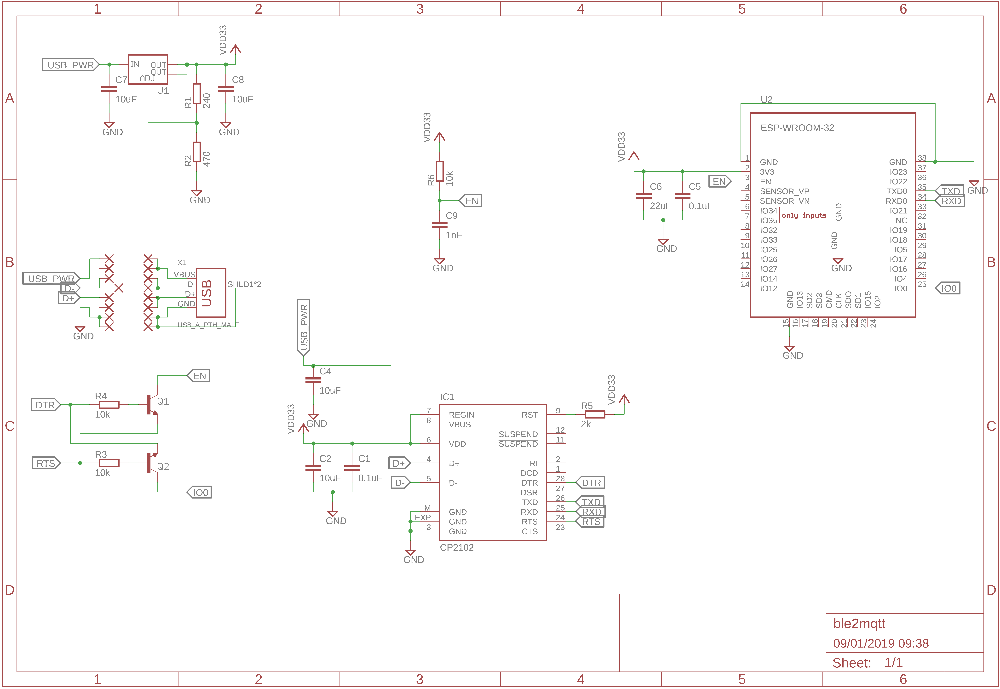
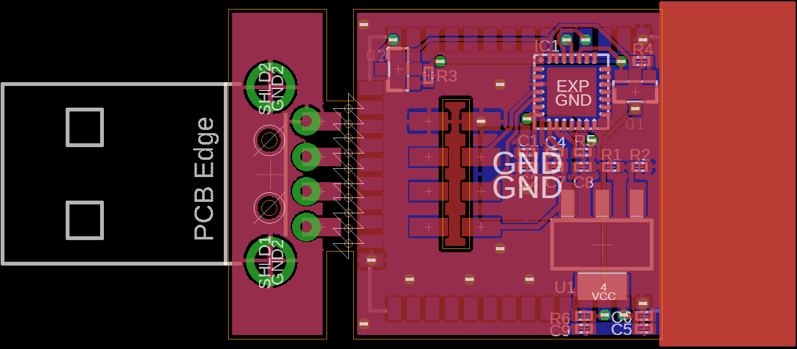

# BLE2MQTT

This PCB is for the ESP32-WROOM-32 module arranged to be in line with a USB wall
wart. It includes a USB-to-Serial controller for loadind the initial software
from [esp32-ble2mqtt](https://github.com/shmuelzon/esp32-ble2mqtt).

The USB header portion is meant to be broken off and soldered vertically in the
appropriate slot.

 
