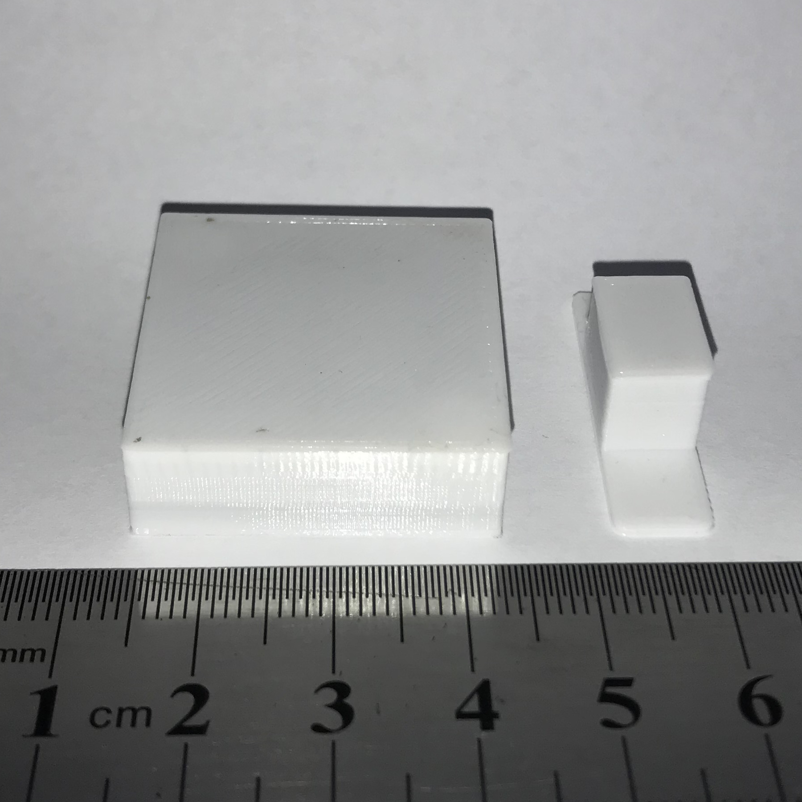
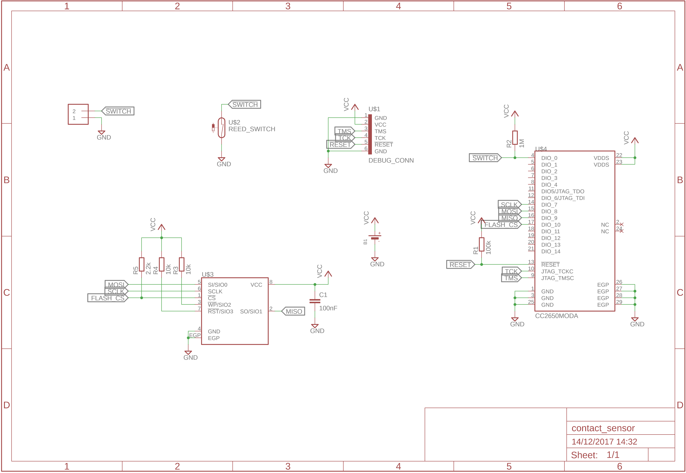
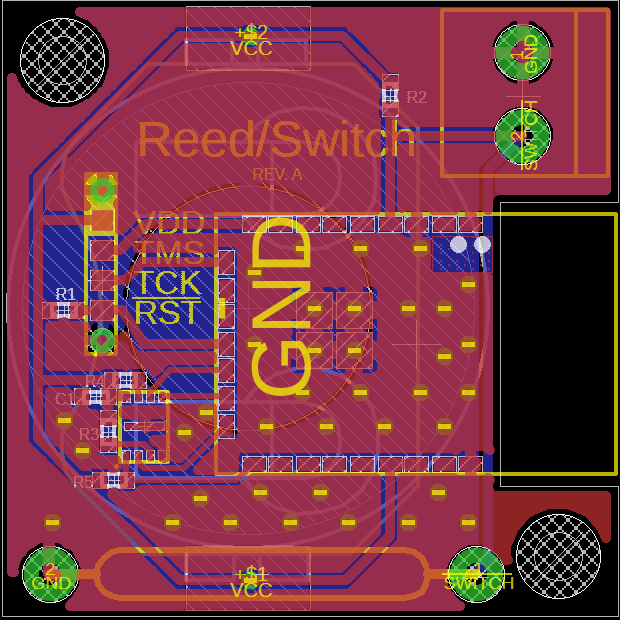

# Contact Sensor

This peripheral is a contact sensor to be used on doors, windows, etc. to detect
when the opening is opened or closed. It contains two parts. The first is the
main unit with the BLE controller a reed switch while the second contains a 6mm
x 10mm cylindrical magnet.

It can also be used as switch by populating the terminal connector instead of
the reed relay.

Battery Type: CR2032

Board configuration for
[cc2640-home-automation](https://github.com/shmuelzon/cc2640-home-automation):
```c
#define Board_CONTACT                       IOID_0
#define Board_BATT_MAX                      3000
#define Board_BATT_MIN                      1800
```
Or, if using as a switch:
```c
#define Board_SWITCH                        IOID_0
#define Board_BATT_MAX                      3000
#define Board_BATT_MIN                      1800
```



 
