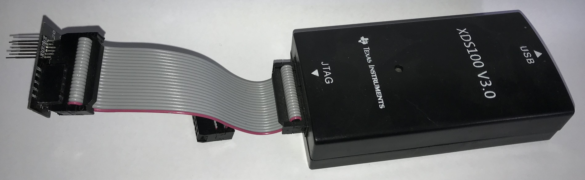
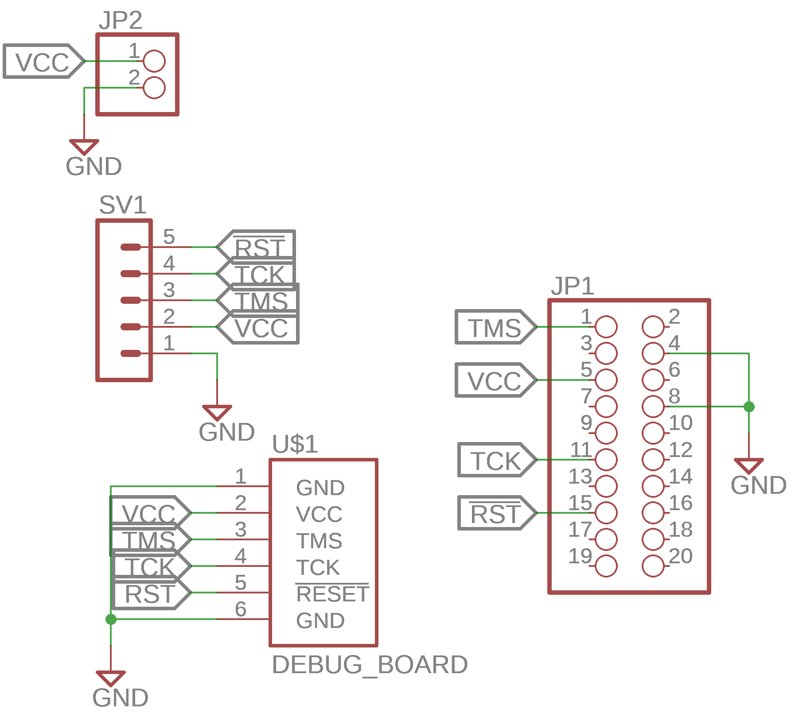
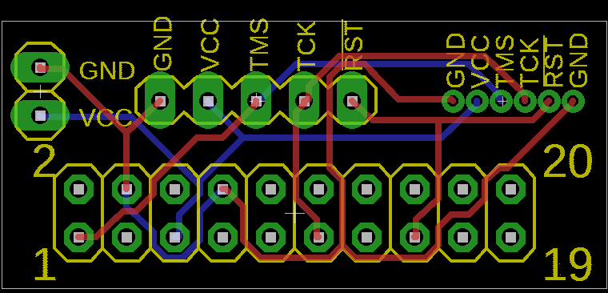

# Debug Board

This board is to connect the XDS100v3 (or similar) to the BLE peripherals in
this repository. The pogo pins, used to create contact with the BLE PCBs, should
be soldered in a manner that the out-most pins are a bit lower than the rest.
This should allow easier aligning of the pins with the BLE peripheral PCB.

The pogo pins must be soldered straight and can be easily done by stacking a few
of these PCBs together before soldering.

External power can also be applied using the additional pin headers instead of
relying on the peripheral's power source (which should be disconnected if not
used).

 
