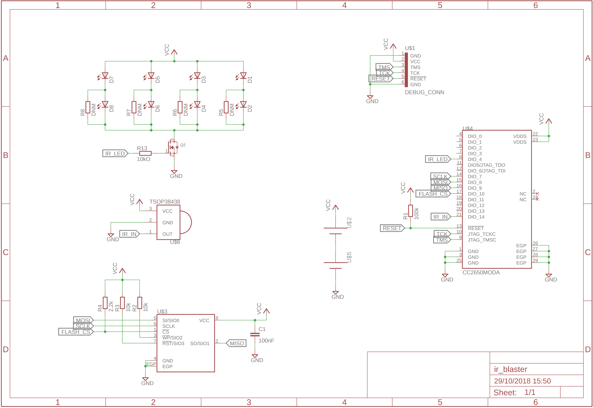
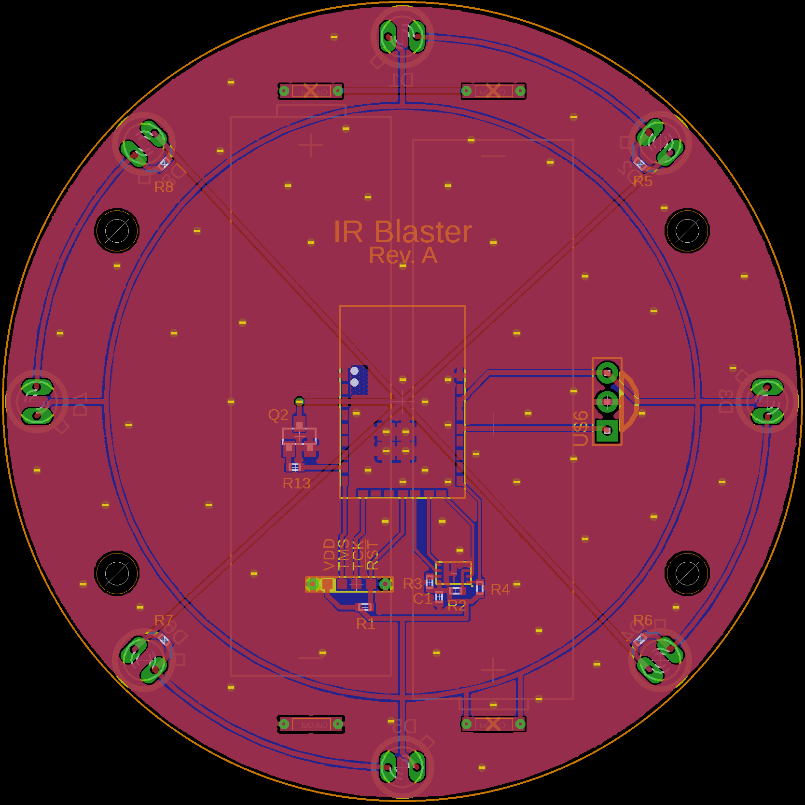

# IR Blaster

This peripheral is a IR blaster allowing sending IR commands just like any IR
remote. Most household devices controlled by IR remotes, e.g. TVs, air
conditioners, fans, etc., may also be controlled from this peripheral.

Using an IR receiver, it's also possible to receive commands from standard IR
remotes and act upon these events to trigger additional actions.

Battery Type: 2 x AA

Board configuration for
[cc2640-home-automation](https://github.com/shmuelzon/cc2640-home-automation):
```c
/* N/A - Software implementation has not been completed */
```

 
