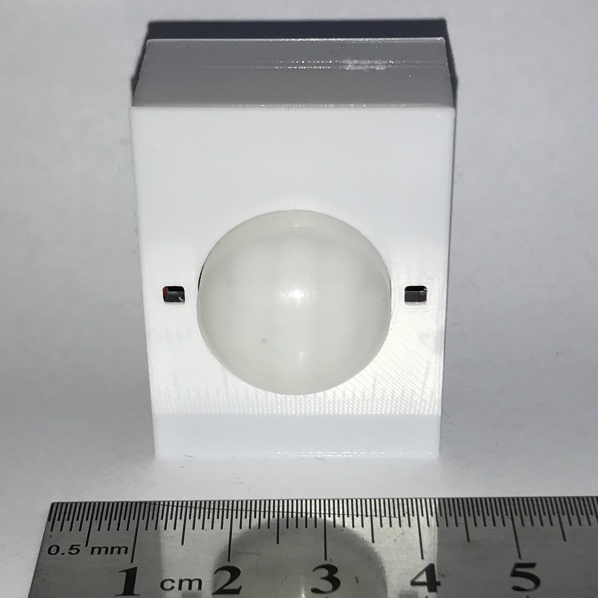
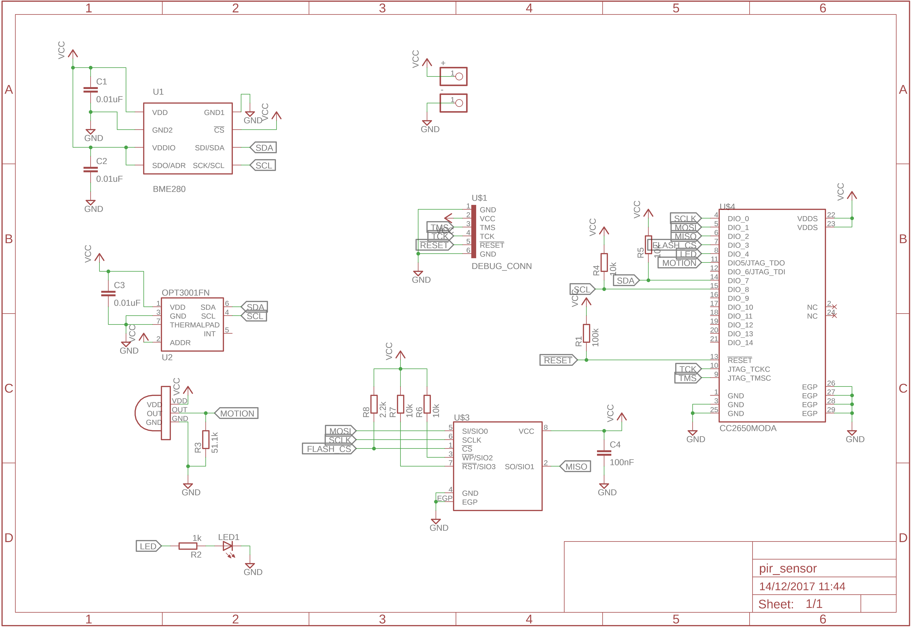
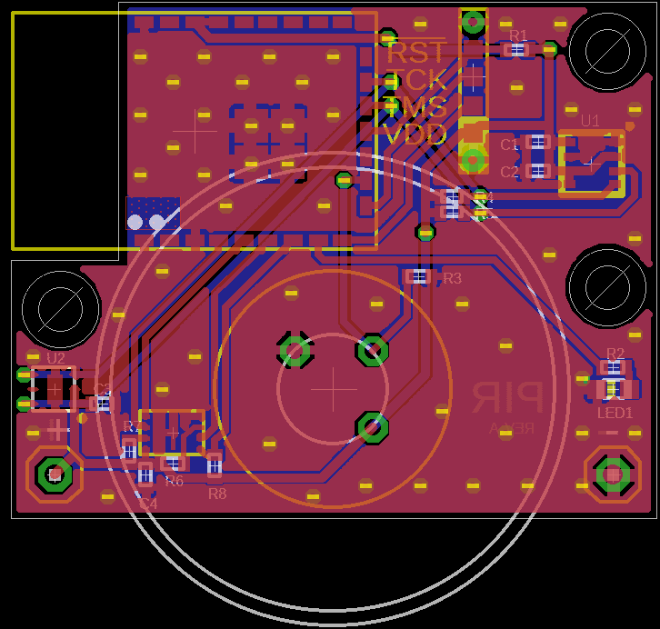

# PIR Sensor

This peripheral is a multi-sensor device including a PIR motion sensor, ambient
light sensor, ambient temperature sensor, relative humidity sensor and pressure
sensor.  It also in includes an LED that will turn on when motion was detected.
Depending on the kind of traffic expected where this device will be placed,
consider disabling the LED to conserve battery power.

Battery Type: 1/2 AA (ER14250)

Board configuration for
[cc2640-home-automation](https://github.com/shmuelzon/cc2640-home-automation):
```c
#define Board_LED1                          IOID_4
#define Board_I2C0_SDA0                     IOID_7
#define Board_I2C0_SCL0                     IOID_8
#define Board_MOTION                        IOID_5
#define Board_OPT3001_ADDR                  (0x45)
#define Board_BME280_ADDR                   (0x77)
#define Board_BATT_MAX                      3600
#define Board_BATT_MIN                      1800
```



 
