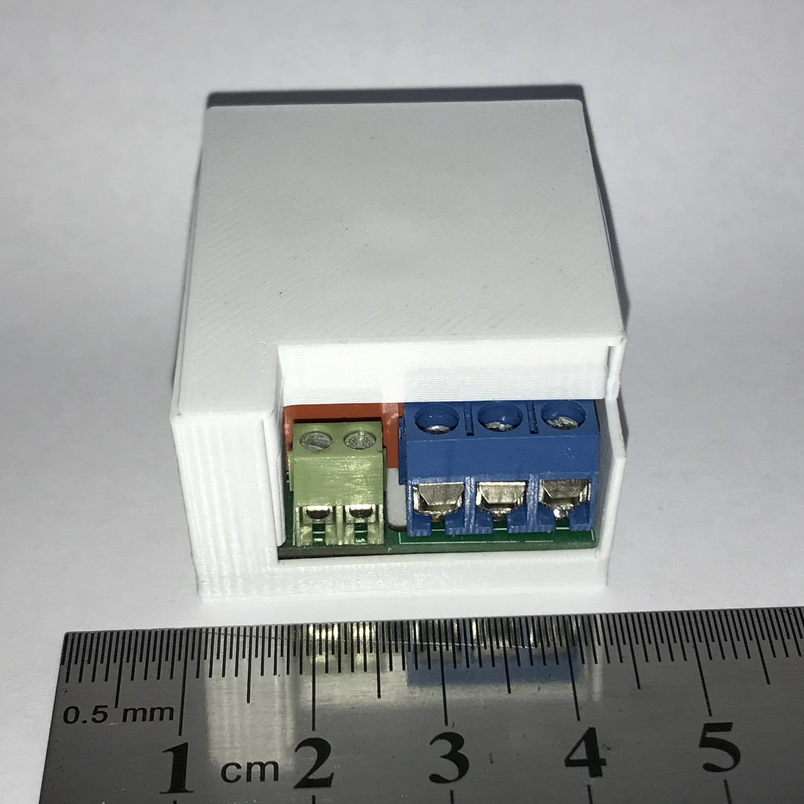
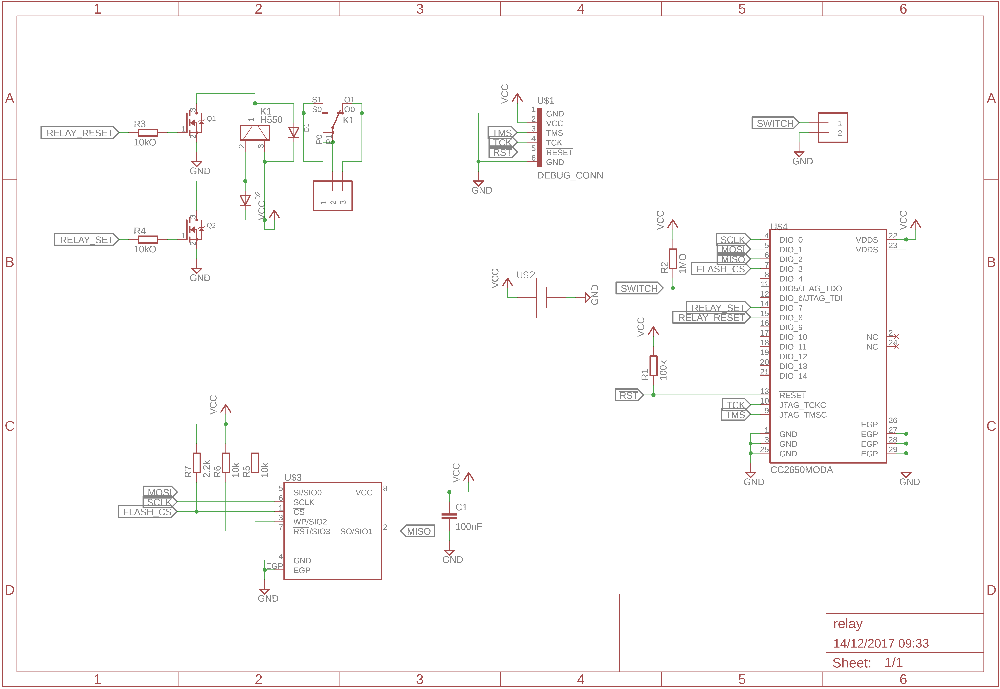
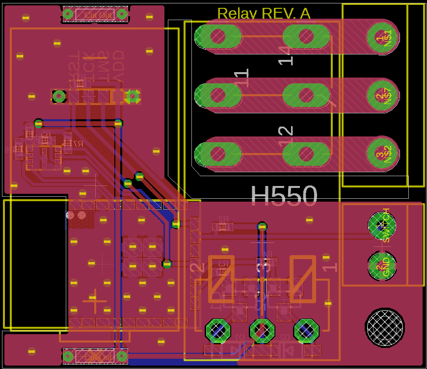

# Relay

This peripheral is a relay with switch sensor. It's to be placed behind the wall
switch where the live wires should be connected to the inner terminals of the
blue block and additional wires should be connected to the green terminals and
the physical switch.

Toggling the switch will toggle the relay.

Battery Type: CR2

Board configuration for
[cc2640-home-automation](https://github.com/shmuelzon/cc2640-home-automation):
```c
#define Board_SWITCH                        IOID_5
#define Board_RELAY_SET                     IOID_7
#define Board_RELAY_RESET                   IOID_8
#define Board_BATT_MAX                      3000
#define Board_BATT_MIN                      2100
```



 
