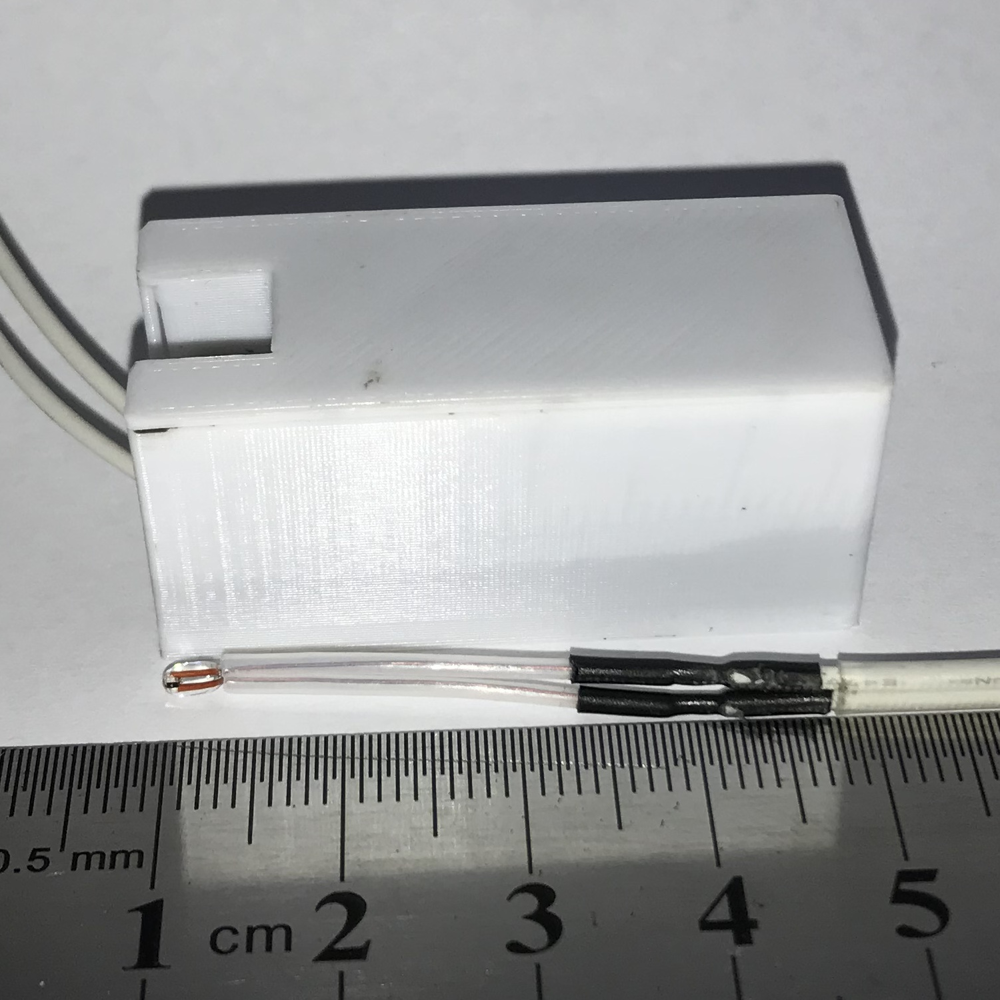
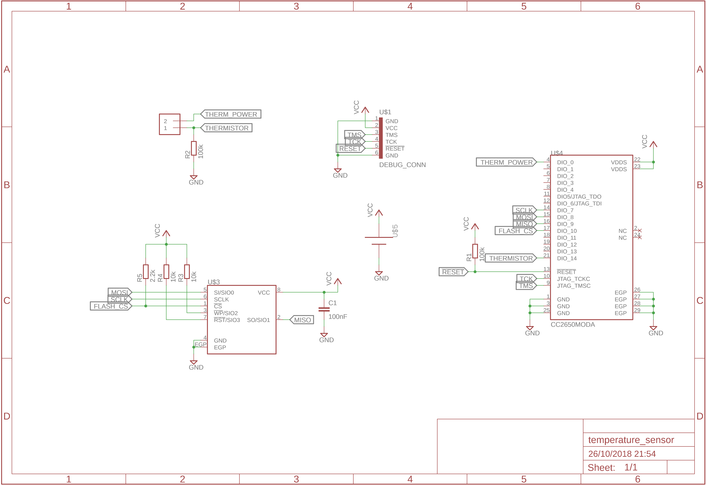
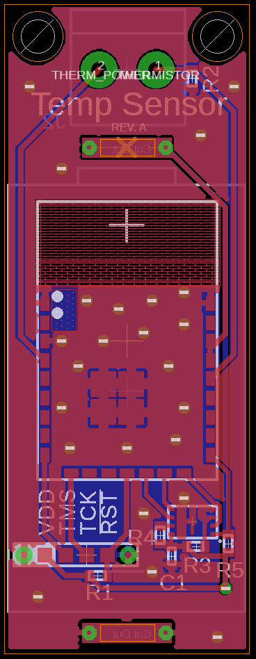

# Temperature Sensor

This peripheral is a temperature sensor based on a thermistor. It can be used to
measure the temperature at various locations, e.g. the thermostat of a water
heater / boiler.

Battery Type: 1/2 AA (ER14250)

Board configuration for
[cc2640-home-automation](https://github.com/shmuelzon/cc2640-home-automation):
```c
#define Board_THERMISTOR_POWER              IOID_0
#define Board_THERMISTOR                    Board_ADC7
#define Board_BATT_MAX                      3600
#define Board_BATT_MIN                      1800
```



 
