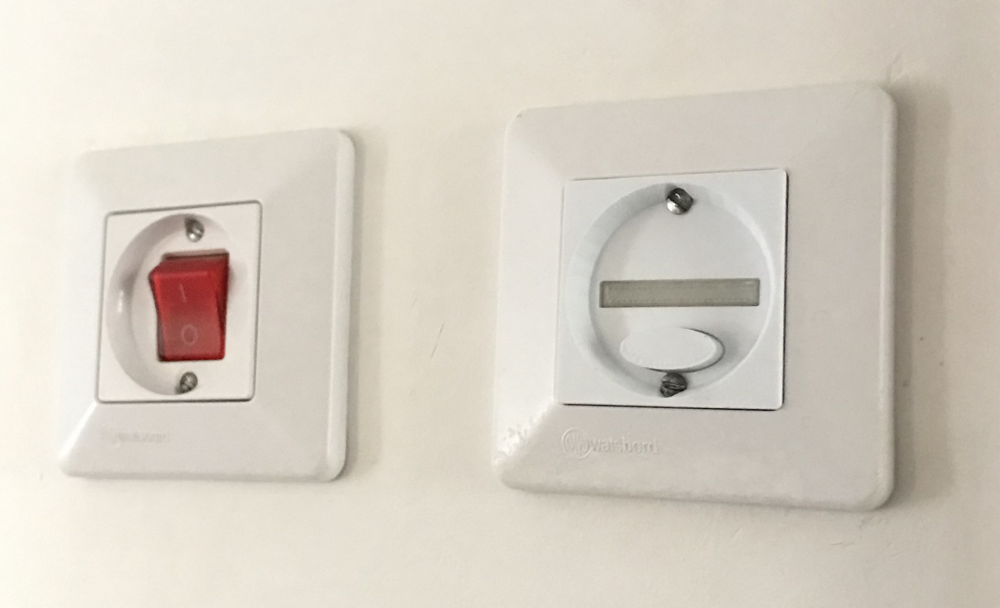
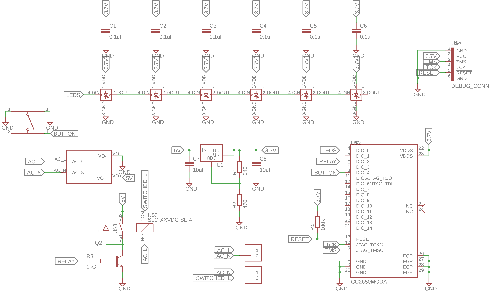
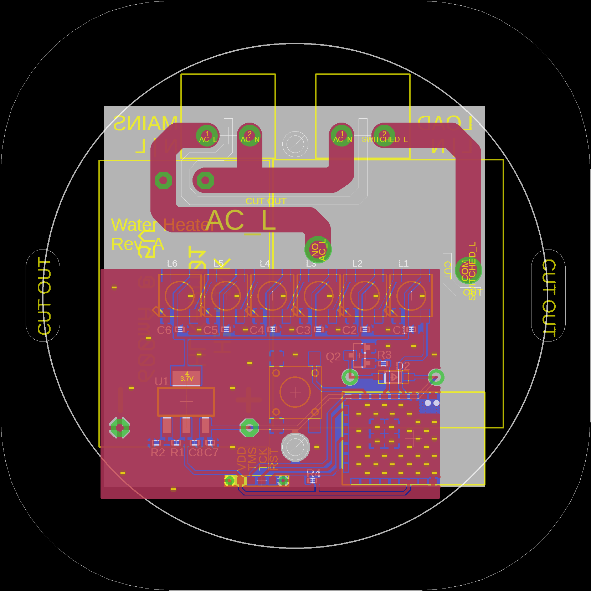

# Water Heater

This peripheral is switch of a water heater or any high-load device. It also
includes 6 addressable RGB LEDs that can be used to display additional
information, e.g. the current temperature of the water inside the water heater.

Board configuration for
[cc2640-home-automation](https://github.com/shmuelzon/cc2640-home-automation):
```c
#define Board_BUTTON                        IOID_4
#define Board_RELAY_SET                     IOID_2
#define Board_SPI0_MOSI                     IOID_0
#define Board_WS2812_NUM_LEDS               6
#define Board_RGB_NUM_LEDS                  (Board_WS2812_NUM_LEDS)
#define EXCLUDE_BATT
```



 
